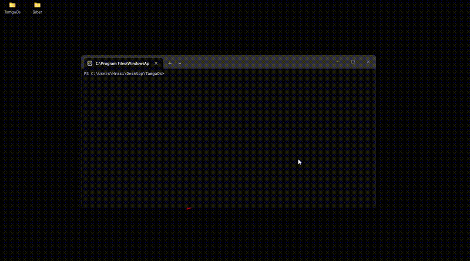

# TamgaOS (yula)


  


Experimental x86 operating system written in **Zig 0.16.0** and **C**.

TamgaOS started as a small learning kernel for exploring low-level systems programming, executable formats, bootloaders, memory layouts, and operating system internals.

The project is still in an early experimental stage. The goal is to understand the boot process step by step and build the kernel piece by piece while comparing low-level implementation details between Zig and C.

## Current status

Features currently implemented:

* Basic Global Descriptor Table (GDT) setup
* Zig and C kernel implementations for comparison
* ISO generation through xorriso
  
Both Zig and C versions successfully boot through **Limine** using a **Multiboot2** header.

Current output:

```text
Zig -> TamgaOS
       KERNEL OK

C   -> TamgaOS __C__
       GDT OK __C__
       Kernel OK __C__
```

## Building

Build the Zig kernel:

```powershell
zig build -Doptimize=ReleaseFast
```

Copy the generated kernel --zig-out/bin/...-- to `iso/boot/` and the generated `c_kernel` to `iso_c/boot/`.

Generate the C kernel ISO:

```powershell
.\mkiso_c.ps1
```

or for Zig kernel:  
```powershell
.\mkiso.ps1
```

ISO generation uses **xorriso**.

and 
for C_kernel:  
```powershell
 qemu-system-i386 -cdrom .\TamgaOS_C.iso -boot d  
```

if with log on serial for C kernel

```powershell
qemu-system-i386 -cdrom .\TamgaOS_C.iso -boot d -serial stdio
```
or 

for Zig kernel  
```powershell
 qemu-system-i386 -cdrom .\TamgaOS.iso -boot d  
```
if with log on serial for Zig Kernel

```powershell
qemu-system-i386 -cdrom .\TamgaOS.iso -boot d -serial stdio
```

## Notes

This is not a production operating system.  
Development notes on https://auctra.app 
